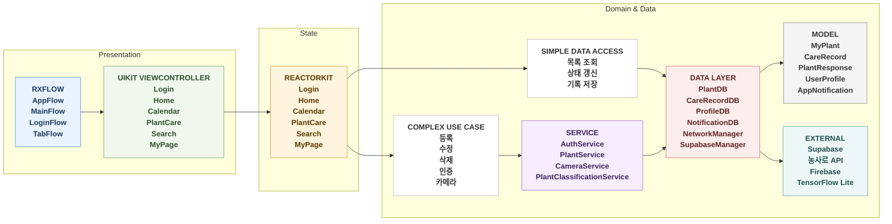
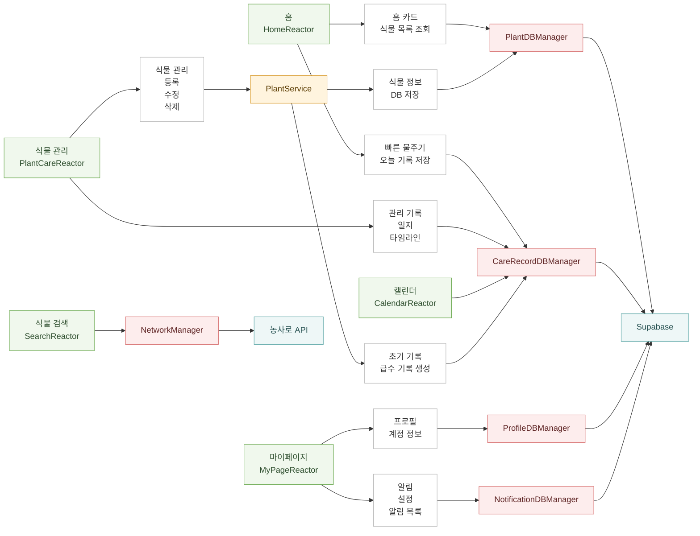

# 🌿 잎로그(LeafLog)

> ****반려식물의 성장과 관리 기록을 돕는 iOS 식물 다이어리 애플리케이션****
> [ 🪴잎로그 앱스토어 다운로드](https://apps.apple.com/kr/app/%EC%9E%8E%EB%A1%9C%EA%B7%B8-leaflog-%EB%82%98%EB%A7%8C%EC%9D%98-%EC%8B%9D%EB%AC%BC-%EB%8B%A4%EC%9D%B4%EC%96%B4%EB%A6%AC/id6763549967)


잎로그는 사용자가 키우는 식물을 등록하고, 물주기와 관리 기록을 날짜별로 남길 수 있는 앱입니다.

식물 검색, AI 식물 식별, 캘린더 기록, 다이어리, 푸시 알림 기능을 통해 반려식물을 꾸준히 관리할 수 있습니다.

<br>

# 📅 프로젝트 기간

2026.03.31. ~ (2026.05.07.)

<br>

# 📋 패치노트
**2026.04.25.** 1.0.0.: 최초 배포
 
**2026.05.05.** 1.0.1. 업데이트: UI 개선, 식물 등록일 기능 추가, 이미지 업로드 방식 개선, 업데이트 확인 기능 추가
 
**2026.05.21.** 1.0.2. 업데이트: async await 리팩토링, 네비게이션 스택 버그 수정, 갤러리 이미지 검색 기능 추가

<br>

# 👥 팀 소개

**Team Jooslin**

| 이름 | 담당 기능 |
|---|---|
| 변예린 | RxFlow 초기 세팅, 알림, 홈 화면, 캘린더 화면, AI 식물 식별 |
| 김주희 | Supabase DB, 스플래시 화면, 소셜 로그인 및 회원탈퇴, 마이페이지, 식물 상세 - 기록탭 / 타임라인 탭 |
| 장예슬 | API 검색, 공용 UI, 식물 검색, 식물 등록, 식물 상세 - 정보탭 |
| 김아정 | UX/UI 디자인, 로고 및 아이콘 제작 |

<br>

# 📂 프로젝트 폴더 구조

프로젝트는 ****ReactorKit 기반 구조에 맞게 역할별로 디렉토리를 분리****하여 관리했습니다.

```text

LeafLog
│
├── App
│ ├── Flows
│ ├── Notification
│ ├── AppConfig
│ └── SupabaseManager
│
├── Auth
│
├── Model
│
├── Network
│
├── Reactor
│
├── Service
│
├── Util
│
└── View

```

<br>

# 🖼️ 다이어그램

### 전체 프로젝트 흐름

### 주요 데이터 흐름



<br>

# 🧰 기술 스택

| 분류 | 라이브러리 |
|---|---|
| Language | Swift |
| Architecture | ReactorKit, RxFlow, RxSwift |
| UI | UIKit, SnapKit, Then |
| Database | Supabase |
| Network | Alamofire, XMLCoder, Kingfisher |
| Auth | Apple Login, Google Sing-In, Kakao Login |
| AI | TensorFlowLiteSwift |
| Notifications | Firebase Messaging |

<br>


# 🔑 실행 전 준비 사항

잎로그는 농사로 API, Supabase, Kakao Login, Google Sign-In, Firebase Messaging을 사용하기 때문에 프로젝트 실행 전에 아래 설정 파일이 필요합니다.

해당 파일들은 API Key와 인증 정보가 포함되어 있어 Git에 포함하지 않고, 로컬 환경에서 직접 추가해야 합니다.

## 1. Secrets.xcconfig 추가

프로젝트 루트의 `LeafLog/Secrets.xcconfig` 파일을 생성한 뒤 아래 내용을 추가합니다.

```xcconfig
NONGSARO_API_KEY = your_api_key
NONGSARO_BASE_URL = https:/$()/api.nongsaro.go.kr/service/garden
SUPABASE_URL = voleebkqcpkwtliktbos.supabase.co
SUPABASE_ANON_KEY = your_anon_key
KAKAO_NATIVE_APP_KEY = your_kakao_native_app_key
REVERSED_CLIENT_ID = your_reversed_client_id
```

- `NONGSARO_API_KEY`: 농사로 Open API 인증 키
- `SUPABASE_ANON_KEY`: Supabase 프로젝트의 anon public key
- `KAKAO_NATIVE_APP_KEY`: Kakao Developers에서 발급받은 Native App Key
- `REVERSED_CLIENT_ID`: GoogleService-Info.plist의 `REVERSED_CLIENT_ID` 값


## 2. GoogleService-Info.plist 추가

Google Sign-In과 Firebase Messaging 사용을 위해 `LeafLog/LeafLog/Configuration/GoogleService-Info.plist` 파일을 추가해야 합니다.

해당 파일은 Firebase Console에서 iOS 앱 설정 파일을 다운로드하거나, 공유받은 `GoogleService-Info.plist` 내용을 그대로 추가합니다.

파일에는 아래 항목들이 포함되어 있어야 합니다.

```plist
CLIENT_ID
REVERSED_CLIENT_ID
API_KEY
GCM_SENDER_ID
PLIST_VERSION
BUNDLE_ID
PROJECT_ID
STORAGE_BUCKET
IS_ADS_ENABLED
IS_ANALYTICS_ENABLED
IS_APPINVITE_ENABLED
IS_GCM_ENABLED
IS_SIGNIN_ENABLED
GOOGLE_APP_ID
```

위 설정 파일이 없으면 API 요청, 소셜 로그인, 푸시 알림 기능이 정상적으로 동작하지 않을 수 있습니다.

<br>

# 🏗 아키텍처

### ReactorKit 채택 이유

- Massive ViewController 이슈 방지
- UI / 비즈니스 로직 분리 - 병렬 개발 용이
- 단방향 코드 흐름으로 인해 비교적 낮은 버그 발생 가능성
- 상태 관리의 용이성

### RxFlow 채택 이유

- 화면 전환 로직을 ViewController에서 분리 → 책임 경량화
- 화면 흐름을 한 곳에서 쉽게 파악 가능

### Swift Dependency 채택 이유

- 주입 객체를 상수로 선언하지 않아 사이드 이펙트를 줄일 수 있음
- preview에서 실제로 동작하기 힘든 부분을 mock up 데이터를 사용한 객체로 임시 실행 가능

<br>

# 📋 의사 결정 기록

[📋260331 AI 모델 선정 논의](https://leaflog.notion.site/260331-AI-3564589f9d0f807cb509c87471d0f0d7?source=copy_link)

[📋260401 데이터베이스 결정 논의](https://leaflog.notion.site/260401-3564589f9d0f80ce87b2c47c72fdc5e2?source=copy_link)

[📋260401 개발 기본사항 결정 논의](https://leaflog.notion.site/260401-3564589f9d0f80d68595e5763c9571d0?source=copy_link)

[🖌️260406 식물 등록 모델에 관한 논의](https://leaflog.notion.site/260406-3564589f9d0f80718a8ad2030ebca924?source=copy_link)

[📋260407 API Key 저장 방식 결정](https://leaflog.notion.site/260407-API-Key-3564589f9d0f80b88134ea7900f738b2?source=copy_link)

# ⭐ 핵심 기능

## 🔐 소셜 로그인

<p align=center></p>


LeafLog는 Supabase를 통한 Google, Kakao 소셜 로그인과 on-device 라이브러리를 통한 Apple 로그인을 지원합니다.

로그인 성공 시 메인 화면으로 이동하며, 실패 시 알림창을 통해 오류 메시지를 안내합니다.

하단에는 이용약관과 개인정보처리방침 링크를 제공하며, 선택 시 SFSafariViewController를 통해 해당 문서로 이동합니다.

로그인 성공 후 FCM 토큰을 저장하여 Supabase에 저장된 토큰과 동기화합니다.

<br>

## 🏠 홈 화면

<p align=center></p>

사용자가 등록한 식물을 한눈에 확인할 수 있는 메인화면입니다.

'물주기 버튼'으로 빠르게 급수 기록을 저장할 수 있어 사용자의 관리 흐름을 간단하게 하였습니다.

UICollectionView로 구현되었으며, 선반 모양을 구현하기 위해 snapshot에 사용되는 dataSource는 3의 배수로 생성됩니다.

<br>

## 🔍 식물 등록 및 검색

<p align=center></p>

검색어와 필터링을 통해 원하는 식물을 검색하고 기본 정보를 불러올 수 있습니다.

식물 이름, 상세 정보, 이미지 정보를 조회에는 **농사로 API**를 활용하였습니다.

검색어 외에 on-Device AI를 활용한 카메라 검색 기능을 통해 이미지로도 식물을 식별할 수 있습니다.

검색 결과에서 식물을 선택하여 해당 정보를 가지고 식물 등록 화면에서 '내 식물'로 저장할 수 있습니다.

<br>

## 📆 캘린더 화면

<p align=center></p>

캘린더 화면에서는 날짜별 식물 관리 기록을 월 단위로 확인할 수 있습니다.

각 관리 항목에 따른 필터링 기능을 제공하여 원하는 기록만 골라 볼 수 있습니다.

특정 날짜를 선택하면 해당 날짜에 기록된 상세 관리 내역을 확인하고, 해당 식물 기록으로 이동할 수 있습니다.

<br>

## 📝 식물 관리 화면

식물 관리 화면에서는 날짜별로 관리 기록을 남기거나 식물 정보, 식물 기록을 조회할 수 있습니다.

UISegmentControl로 구현된 탭 Component를 통해 사용자가 손쉽게 필요한 카테고리로 전환할 수 있습니다.

<br>

### 1) 관리 기록 기능

<p align=center></p>


물주기, 분갈이, 비료, 치료 기록과 '오늘의 일기' 기록을 날짜별로 저장할 수 있습니다.

### 2) 식물 정보, 타임라인 기능

<p align=center></p>

식물 정보 탭에서는 등록한 식물의 기본 정보와 관리 가이드를 확인할 수 있습니다.

타임라인 탭에서는 지금까지 저장한 관리 기록을 시간 순서대로 확인할 수 있습니다.

<br>

## 👤 마이페이지

<p align=center></p>

마이페이지에서는 사용자 프로필과 알림 설정, 사용자 계정(로그아웃 및 회원 탈퇴) 관리를 할 수 있습니다.

토글을 통해 푸시 알림 설정을 변경할 수 있으며, 문의하기 등 앱 지원에 관한 사항과 앱 버전 확인 기능을 제공합니다.

<br>


## 🔔 알림 센터 화면

<p align=center></p>

알림 센터에서는 식물 관리와 관련된 알림 기록을 확인할 수 있습니다.

사용자는 FCM 기반 푸시 알림을 통해 급수가 필요한 식물에 대해 관리 시점을 놓치지 않고 확인할 수 있습니다.

<br>

# 🛠 Troubleshooting

<details>
<summary> ⚠️ API 요청은 성공했는데(HTTP 200) 데이터가 오지 않는 문제 </summary>

## 문제 요약

요청은 성공했는데(HTTP 200), 검색 결과가 비어 있거나 정상 데이터가 오지 않는 문제가 발생했다.

## 원인

농사로 API는 **성공 기준이 2개**였다.

1. **HTTP 상태 코드 (통신 성공)**
2. **API 내부 결과 코드 (실제 처리 성공)**

즉,

- HTTP 200 → 서버랑 통신만 성공
- 실제 성공 여부 → `header.resultCode == "00"` 확인 필요

이 부분을 놓쳐서 문제가 발생했다.

---

## ✅ 해결 방법

### 핵심 아이디어

HTTP 검증 + API 검증을 **둘 다 해야 한다**

### 처리 흐름

1. HTTP 상태 코드 검증
2. XML 디코딩
3. `resultCode == "00"` 검증
4. 데이터 사용

## 구현 방식

### 1. API 검증 함수

```swift
private func validate(header: PlantResponseHeader) throws {
    guard header.resultCode == "00" else {
        throw NetworkError.apiError(code: header.resultCode, message: header.resultMsg)
    }
}
```

### 2. 응답 직후 검사

```swift
let response: PlantListResponse = try await request(...)
try validate(header: response.header)
```

### 3. 에러 분리

```swift
enum NetworkError {
    case apiError
    case transportError
    case decodingFailed
    case emptyResult
}
```

→ 네트워크 실패 vs API 실패를 구분해서 처리

## 핵심 정리 (중요)

- HTTP 성공 ≠ API 성공
- API는 반드시 `resultCode` 확인해야 한다
- 검증 로직은 공통으로 사용가능하게 메서드로 만들어 사용하는 게 좋다.

</details>

<details>
<summary> ⚠️ Apple 로그인 후 Supabase 세션이 남아버리는 문제 해결 </summary>

# **Apple 로그인 후 Supabase 세션이 남아버리는 문제 해결**

## **문제 상황**

LeafLog에서는 Apple, Google, Kakao 소셜 로그인을 지원한다.

그중 Apple 로그인은 단순히 Supabase Auth에 로그인하는 것뿐만 아니라, 이후 회원탈퇴 처리를 위해 Apple authorizationCode를 서버에 저장하는 과정이 추가로 필요했다.

문제는 Apple 로그인 과정에서 다음과 같은 상황이 발생할 수 있다는 점이었다.

1. Apple 로그인 UI에서 인증 성공
2. Supabase Auth 세션 생성 성공
3. Edge Function을 통해 Apple 토큰 저장 시도
4. 토큰 저장 실패
5. 하지만 앱에는 Supabase 로그인 세션이 남아 있음

즉, 사용자는 실제로는 Apple 로그인 정보 저장에 실패했는데 앱 내부에서는 로그인된 상태처럼 동작할 수 있었다.

이 상태가 되면 이후 화면 전환, 프로필 생성, 회원탈퇴 로직에서 예상하지 못한 오류가 발생할 수 있었다.

---

## **원인 분석**

Apple 로그인은 Google/Kakao 로그인보다 처리해야 하는 단계가 많았다.

기존 로그인 흐름은 대략 아래와 같았다.

```jsx
let credential = try await appleProvider.fetchCredential(
    presentingViewController: presentingViewController
)

try await supabase.auth.signInWithIdToken(
    credentials: .init(
        provider: .apple,
        idToken: credential.idToken,
        nonce: credential.rawNonce
    )
)

let session = try await supabase.auth.session

try await storeAppleToken(
    credential: credential,
    accessToken: session.accessToken
)
```

여기서 핵심 문제는 signInWithIdToken이 성공한 뒤 storeAppleToken이 실패하면, Supabase 세션은 이미 생성된 상태라는 점이었다.

즉, 로그인 전체 과정은 실패했지만 앱 입장에서는 세션이 남아 있어 “로그인 성공처럼 보이는 중간 상태”가 생겼다.

---

## **해결 방법**

Apple 토큰 저장에 실패하면 로컬 Supabase 세션을 명시적으로 정리하도록 수정했다.

```jsx
do {
    try await storeAppleToken(
        credential: credential,
        accessToken: session.accessToken
    )
} catch {
    await signOutLocalSession()
    throw AuthError.sessionFailed(
        "Apple 로그인 정보를 저장하지 못했어요. 잠시 후 다시 시도해주세요."
    )
}
```

그리고 로컬 세션 정리는 별도 함수로 분리했다.

```jsx
private func signOutLocalSession() async {
    try? await supabase.auth.signOut(scope: .local)
}
```

이렇게 처리하면서 Apple 로그인은 다음 흐름을 보장하게 되었다.

1. Apple 인증 성공
2. Supabase 세션 생성
3. Apple 토큰 저장 성공
4. 프로필 row 확인 또는 생성
5. 모든 과정이 성공해야만 로그인 성공 처리

중간 단계에서 실패하면 세션을 정리하고 사용자에게 에러 메시지를 보여준다.

---

## **추가로 고려한 부분**

로그인 성공 후 바로 메인 화면으로 이동하지 않고, profiles 테이블에 사용자 프로필이 존재하는지도 확인했다.

```jsx
private func ensureProfileExists(for user: Supabase.User) async throws {
    do {
        _ = try await profileDBManager.createProfileIfNeeded()
    } catch {
        await rollbackSession(for: user)
        throw AuthError.profileFailed(
            "사용자 프로필을 저장하지 못했어요. 잠시 후 다시 시도해주세요."
        )
    }
}
```

프로필 생성에 실패했는데 로그인만 성공 처리하면, 이후 홈 화면이나 마이페이지에서 사용자 정보를 가져오지 못하는 문제가 생길 수 있기 때문이다.

그래서 로그인 성공 조건을 단순히 “Auth 세션 생성 성공”이 아니라, “앱에서 필요한 사용자 기본 데이터 준비 완료”까지로 잡았다.

---

## **UIKit 화면 처리**

로그인 화면에서는 LoginReactor에서 로그인 상태를 관리했다.

- 로그인 요청 시작 시 isLoading = true
- 로그인 성공 시 loginSuccess = true
- 실패 시 errorMessage 전달
- 사용자가 Apple 로그인 창을 취소한 경우에는 에러 팝업을 띄우지 않고 로딩만 해제

이렇게 분리하니 LoginViewController는 상태만 보고 버튼 활성화, 화면 이동, alert 표시를 처리할 수 있었다.

```jsx
case .setLoginSuccess:
    newState.isLoading = false
    newState.loginSuccess = true

case .setError(let message):
    newState.isLoading = false
    newState.errorMessage = message
```

덕분에 비동기 로그인 로직과 UIKit 화면 전환 로직이 섞이지 않아서 유지보수가 쉬워졌다.

---

## **결과**

수정 후에는 Apple 로그인 중간 단계에서 실패하더라도 Supabase 세션이 앱에 남지 않게 되었다.

또한 로그인 성공 기준을 명확히 정리했다.

- Supabase Auth 세션 생성
- Apple 토큰 저장
- 사용자 프로필 생성 또는 확인

이 세 가지가 모두 성공해야만 메인 화면으로 이동하도록 변경했다.

---

## **배운 점**

소셜 로그인은 SDK 인증이 성공했다고 해서 앱의 로그인 처리가 끝나는 것이 아니다.

특히 Supabase 같은 BaaS를 사용할 때는 Auth 세션, 서버 저장 로직, 사용자 프로필 데이터가 서로 맞물려 있기 때문에 중간 단계 실패 처리가 중요하다.

이번 문제를 해결하면서 로그인 로직에서 가장 중요한 것은 “성공 기준을 어디까지로 볼 것인가”라는 점이라는 것을 배웠다.

단순히 세션이 만들어졌는지가 아니라, 앱이 실제로 사용할 수 있는 사용자 상태까지 준비되었을 때 로그인 성공으로 처리해야 안정적인 흐름을 만들 수 있었다.

</details>

<details>
<summary> ⚠️ 로그아웃 버튼 클릭 시 로그인 화면으로 전환되지 않는 문제 </summary>

### 🎯  문제: 마이페이지 탭에서 로그아웃 버튼을 눌러도 로그인 화면으로 전환되지 않음

마이페이지 탭에서 로그아웃 버튼을 눌렀는데도 로그인 화면으로 전환되지 않았다.

```swift
final class MyInfoTabFlow: Flow {
	private let navigationController = UINavigationController()
	var root: any RxFlow.Presentable { navigationController }
	
	func navigate(to step: any RxFlow.Step) -> FlowContributors {
		guard let step = step as? AppStep else {
			return .none
		}
		
		switch step {
		case .myInfoTab:
			...
		default:
			return .one(flowContributor: .forwardToParentFlow(withStep: step))
		}
	}
}
```

로그아웃 버튼을 누르면 `.loginRequired` 스텝이 전달된다.

MyInfoTabFlow에는 해당 스텝의 동작을 정의해두지 않았으므로 default로 빠져서 forwardToParentFlow를 통해 LoginFlow의 `.loginRequired`  스텝의 동작까지 전달될 것으로 생각했다.

그러나 로그아웃 버튼을 아무리 눌러도 화면이 전환되지 않았다.

### ❗️ 원인: 현재 실행되고 있는 Flow와 parentFlow의 root 충돌

위 코드에서, default의 경우에 `.one(flowContributor: .forwardToParentFlow(withStep: step))` 으로 처리되고 있다.

이 경우 `.one` 으로 처리하면 현재의 Flow, 즉 MyInfoTabFlow는 살아있는 상태로 parentFlow로 step이 전달된다.

이렇게되면 default를 타고 타고 최상위인 AppFlow 혹은 LoginFlow로 가서 loginVC를 띄우려고 할텐데 이 지점에서 AppFlow나 LoginFlow의 root와 현재 살아있는 MyInfoTabFlow의 서로다른 root가 충돌하게 된다.

그때문에 RxFlow coordinator가 전달된 스텝을 무시해버리거나 UI가 아무 동작을 하지 않게 되버린 것이다.

### ✅ 해결: 현재 실행되고 있는 Flow 종료

로그아웃을 하면 현재 실행되고 있는 화면이 모두 종료되고 로그인 화면으로 돌아가야한다.

따라서 기존에 사용했던 `.one(flowContributor: .forwardToParentFlow(withStep: step))` 대신 `.end(forwardToParentFlowWithStep:)`을 사용하여 현재 Flow를 종료해주면서 step을 전달하도록 하였다.

```swift
final class MyInfoTabFlow: Flow {
	func navigate(to step: any RxFlow.Step) -> FlowContributors {
		guard let step = step as? AppStep else {
			return .none
		}
		
		switch step {
		case .myInfoTab:
			...
		case .loginRequired:
			return .end(forwardToParentFlowWithStep: step))
		default:
			return .one(flowContributor: .forwardToParentFlow(withStep: step))
		}
	}
}
```

MyInfoTabFlow뿐만 아니라 상위 Flow들 (MainFlow, LoginFlow)에도 `.end(forwardToParentFlowWithStep:)`으로 변경해주었다.

이후 로그인 화면으로 정상적으로 넘어가는 것을 확인하였다.
</details>

<br>

# 🚀 향후 개선 사항

- 커뮤니티 기능
- 온보딩 화면
- 식물 검색 결과 다양화
- AI 식별 모델 정확도 개선
